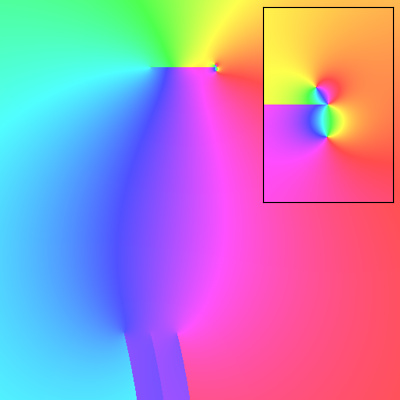

# psitools
 

This is a Python package named psitools. It implements numerical methods and driver routines for solving the linear stability problem of the Polydispserse Streaming Instability (Paardekooper et al. 2020a,b; McNally et al. 2020). 

Please cite the Zenodo record and appropriate papers if you use psitools in a publication.

Figure: A colorized PSI dispersion relation map in the complex plane, showing the poles and branch cuts in a case for a growing size resonance mode.

## Contents
 
* `psitools/`: package source
    * `psitools/complex_roots_mpi.py`: MPI driver for evaluating the PSI dispersion relation
    * `psitools/direct.py`: Direct PSI eigensolver
    * `psitools/direct_mpi.py`: MPI driver for direct PSI eigensolver
    * `psitools/monodisperse_si`: mSI eigensolver
    * `psitools/power_bump.py`: PB dust distribution
    * `psitools/psi_mode.py`: The root-finder PSI eigenvalue solver
    * `psitools/psi_mode_mpi.py`: MPI driver for psi_mode
    * `psitools/psi_grid_refine.py`: MPI based grid-refinement eigenvalue mapper using psi_mode
    * `psitools/tanhsinh.py`: TanhSinh quadrature implementation
    * `psitools/taus_gridding.py`: Gridding functions for direct solver
    * `psitools/terminalvelocitysolver.py`: Terminal velocity approximation PSI eigensolver 
    * `psitools/test_*`: pytest tests, provides functional examples
* `psitools_examples/`: Some additional usage examples
* `anaconda_environments/`: Anaconda Python environment specification with required packages

## Testing

One way to run functional tests, using the included conda specification:

    $ conda env create -f anaconda_environments/STE_environment.yml
    $ conda activate STE

Then install psitools, by directing pip (not system pip, the one inside the 
above environment) to the location of the setup.py:

    $ pip install -e ~/path/to/repo

Before trying to run tests, deactivate and reactivate the conda environment:

    $ conda deactivate
    $ conda activate STE

Then try pytest:

    $ pytest -m "not mpi" path/to/psitools-public

To do the MPI tests, run under MPI with pytest-mpi, which you will probably need to install via pip. pytest-mpi in the current version has repeated output, but something should eventually show up.

    $ mpirun -np 5 python -m pytest --pyargs psitools --with-mpi path/to/psitools-public

To run a specific test, do something like:

    $ mpirun -np 4 python -m pytest --pyargs psitools --with-mpi \
        -s -k "test_psi_grid_refine_0" path/to/psitools-public
        
Or, testing with a virtualenv, do something like:

    $ python -m venv --system-site-packages test-psitools/
    $ . test-psitools/bin/activate
    $ pip install -e ~/path/to/repo
    $ deactivate
    $ . test-psitools/bin/activate

And continue as before.

## Authors / Contributors:
* Colin McNally <colin@colinmcnally.ca>
* Sijme-Jan Paardekooper <s.j.paardekooper@qmul.ac.uk>
* Francesco Lovascio <f.lovascio@qmul.ac.uk>

## License

Copyright 2020 Colin McNally, Sijme-Jan Paardekooper, Francesco Lovascio

This file is part of psitools.

psitools is free software: you can redistribute it and/or modify
it under the terms of the GNU General Public License as published by
the Free Software Foundation, either version 3 of the License, or
(at your option) any later version.

psitools is distributed in the hope that it will be useful,
but WITHOUT ANY WARRANTY; without even the implied warranty of
MERCHANTABILITY or FITNESS FOR A PARTICULAR PURPOSE.  See the
GNU General Public License for more details.

You should have received a copy of the GNU General Public License
along with psitools.  If not, see <https://www.gnu.org/licenses/>.
